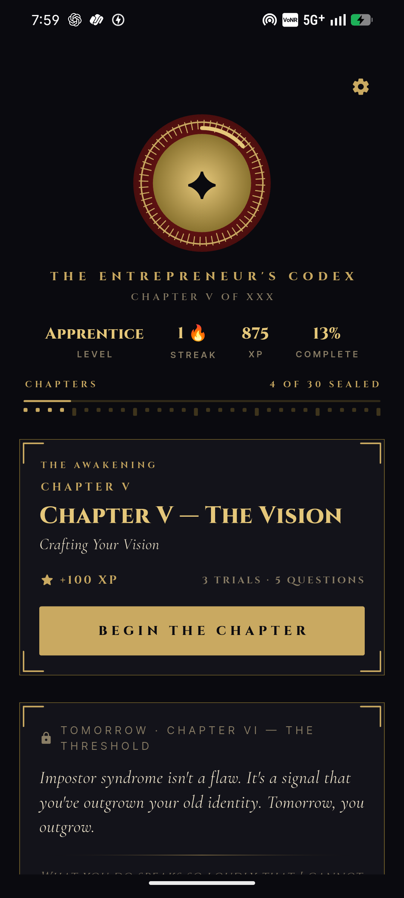

# Valion - The Entrepreneur's Codex

<p align="center">
  
</p>

<p align="center">
  <em>A cinematic 30-day journey of the mind, the hand, and the pen.</em>
</p>

<p align="center">
  
  
  
  
</p>

---

## 📖 Overview

**Valion** is a premium, beautifully crafted mobile application designed for aspiring and veteran entrepreneurs alike. It serves as a 30-day "Codex"—a structured, daily curriculum that merges mindset shifts, actionable skills, and reflective journaling into a single, cohesive cinematic experience.

Rather than just another habit tracker or reading app, Valion is an interactive book of shadows for business. It uses a bespoke dark theme, gold accents, and fluid micro-animations to create an elite, immersive environment for daily growth. Every pixel is designed to inspire action and elevate the user's mindset.

---

## 📱 Interface & Experience

Valion’s interface is meticulously designed to feel like an ancient, golden codex brought into the digital age.

<p align="center">
  
  &nbsp;&nbsp;&nbsp;&nbsp;&nbsp;&nbsp;
  
</p>

---

## ✨ Features

### 1. The 30-Day Codex
A structured daily curriculum that unlocks sequentially. Each day includes:
- **The Manifesto**: The core philosophical mindset shift of the day.
- **The Skill of the Day**: A practical, actionable business skill.
- **The Trial**: Actionable challenges you must physically complete.
- **The Revelation**: Embedded video content and external resources.
- **The Reflection**: A daily journaling prompt tailored to the day's lesson.

### 2. Cinematic UI/UX & Micro-Animations
Built with an uncompromising focus on aesthetics. Features deep blacks (`Codex Ink Black`), rich golds, elegant typography (Cinzel & Cormorant Garamond), and smooth `ScrollReveal` animations that fade and slide elements as they enter the viewport.

### 3. The Journal
A built-in reflection space where you document your daily thoughts and progress. Journal entries are saved locally and can be reviewed at any time to track your mental evolution.

### 4. Milestones, Sharing & Certificates
- **Shareable Milestones**: Beautiful, shareable milestone cards at the end of each day.
- **The Final Seal**: A high-resolution PDF certificate is programmatically generated upon completion of the 30-day journey, ready to be printed or shared.

### 5. Seamless Navigation
Flow effortlessly from one chapter to the next without ever breaking the immersion. Features custom `CinematicPageRoute` transitions, optimized Android 12+ native splash screens (with preview bypassing for zero-flash loading), and integrated state management.

---

## 🛠 Tech Stack & Architecture

- **Framework**: Flutter (Dart)
- **State Management**: `Provider` for reactive UI updates and progress tracking.
- **Local Storage**: `shared_preferences` for offline persistence of progress and journal entries.
- **Design System**: Custom `CodexPalette` and `CodexTypography` built entirely from scratch. Zero external UI libraries used for core styling.
- **PDF Generation**: `pdf` and `printing` packages for the final, dynamically generated certificate.
- **Asset Generation**: Python (`generate_icon.py`) for programmatic SVG-to-PNG logo rendering to ensure exact theme matching, preventing the "AI generated" look.

---

## 🚀 Getting Started

### Prerequisites
- Flutter SDK (`^3.10.8`)
- Android Studio / Xcode (for emulation and building)
- Dart SDK

### Installation

1. Clone the repository:
   ```bash
   git clone https://github.com/Sagarverse/entrepreneurs-codex.git
   ```
2. Navigate to the project directory:
   ```bash
   cd entrepreneur_mindset
   ```
3. Install dependencies:
   ```bash
   flutter pub get
   ```
4. Run the app:
   ```bash
   flutter run
   ```

---

## 📂 Core Project Structure

- `lib/data/curriculum.dart`: The brain of the app. Contains the entire 30-day content matrix.
- `lib/theme.dart`: The source of truth for the app's visual identity (colors, gradients, text styles).
- `lib/services/app_state.dart`: Manages all progress, unlocking logic, and journal entries.
- `lib/widgets/scroll_reveal.dart`: The custom widget driving the cinematic fade-and-slide entrance of elements.
- `lib/widgets/cinematic_intro.dart`: Handles the complex sequence animations for the chapter intros.

---

## 📜 License

**Proprietary Software.**
All rights reserved. Unauthorized copying, modification, or distribution of this software is strictly prohibited.
